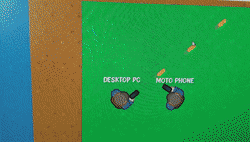

# Godot 3 Multiplayer Shooter

You can follow the tutorial series for making this project [here on YouTube](https://youtube.com/playlist?list=PL6bQeQE-ybqDmGuN7Nz4ZbTAqyCMyEHQa).

Feel free to use the code found in this project in your projects.
Please note that this system will not work in 4.0, without some heavy adaptation.

Only LAN multiplayer is shown in the tutorial series.
If you are looking for WAN multiplayer where users can connect and play together on different networks, you will have to port forward to your server.
If you're unsure what all this networking stuff means you can follow my [blogpost here](https://plug-world.com/posts/godot-multiplayer-lan-vs-wan-explanation/).

This system relies on MultiplayerENet, which means that only Desktop and Mobile platforms will work with multiplayer.
HTML5 Web platforms will not work in this case.

Thanks :)
